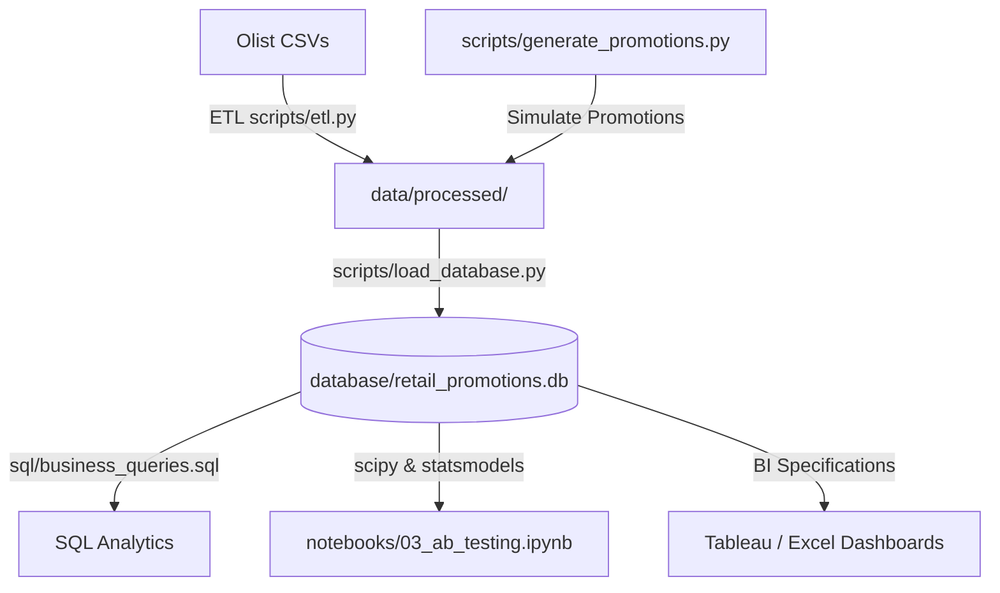

# Retail Promotion Analytics Platform

This project evaluates the business and statistical effectiveness of promotional campaigns on customer conversions, average order value (AOV), revenue, and customer retention. Using the Olist Brazilian E-Commerce dataset, it simulates and compares discount campaigns (P1: 5%, P2: 10%, P3: 20%) against a control group (no promotion).

## Architecture Diagram


## Setup Instructions

1. **Clone the Repository**:
   ```bash
   git clone https://github.com/Shanksreddy005/Retail-Promotion-Analytics-Platform.git
   cd Retail-Promotion-Analytics-Platform
   ```

2. **Install Dependencies**:
   ```bash
   pip install -r requirements.txt
   ```

3. **Add Data**:
   Ensure the Olist CSV dataset files are placed in the root folder.

4. **Run the Execution Pipeline**:
   Execute the following scripts sequentially:
   1. `python scripts/generate_promotions.py`
   2. `python scripts/etl.py`
   3. `python scripts/load_database.py`

## Execution Order
1. **generate_promotions.py**: Simulates P1, P2, P3 campaign definitions and assigns them deterministically (seed `42`) to 35% of orders.
2. **etl.py**: Ingestion, validation, deduplication, and feature engineering.
3. **load_database.py**: Creation of schema and loading of processed dimensions/facts into SQLite/PostgreSQL.
4. **SQL Analysis**: Executing queries in `sql/business_queries.sql`.
5. **Notebooks**: Analytical walk-throughs under `notebooks/`.
6. **Dashboard Development**: Using configurations in `tableau/` and `excel/`.

## Key Business Insights
- **Promotion Revenue**: P1 generated the highest revenue ($1.86M) and maintained the highest AOV ($159.97).
- **Statistical Significance**: Promotion-driven conversion is statistically significant (Z-test p = 0.0000), but AOV differences are not statistically significant (T-test p = 0.3440).
- **Optimal Choice**: P2 (10% discount) represents the best retention-to-margin tradeoff with a 6.48% conversion rate.

*Deterministic seed utilized for promotions assignment: **42***.
