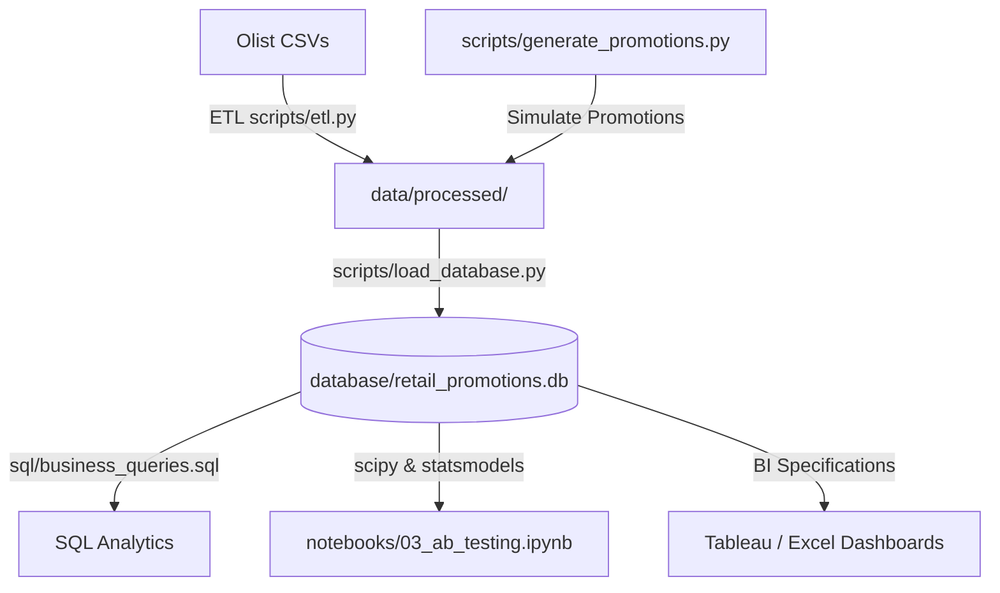

# Retail Promotion Analytics Platform

This project evaluates the business and statistical effectiveness of promotional campaigns on customer conversions, average order value (AOV), revenue, and customer retention. Using the Olist Brazilian E-Commerce dataset, it simulates and compares discount campaigns (P1: 5%, P2: 10%, P3: 20%) against a control group (no promotion).

## Architecture Diagram


## Setup Instructions

1. **Clone the Repository**:
   ```bash
   git clone https://github.com/Shanksreddy005/Retail-Promotion-Analytics-Platform.git
   cd Retail-Promotion-Analytics-Platform
   ```

2. **Install Dependencies**:
   ```bash
   pip install -r requirements.txt
   ```

3. **Add Data**:
   Ensure the Olist CSV dataset files are placed in the root folder.

4. **Run the Execution Pipeline**:
   Execute the following scripts sequentially:
   1. `python scripts/generate_promotions.py`
   2. `python scripts/etl.py`
   3. `python scripts/load_database.py`

## Execution Order
1. **generate_promotions.py**: Simulates P1, P2, P3 campaign definitions and assigns them deterministically (seed `42`) to 35% of orders.
2. **etl.py**: Ingestion, validation, deduplication, and feature engineering.
3. **load_database.py**: Creation of schema and loading of processed dimensions/facts into SQLite/PostgreSQL.
4. **SQL Analysis**: Executing queries in `sql/business_queries.sql`.
5. **Notebooks**: Analytical walk-throughs under `notebooks/`.
6. **Dashboard Development**: Using configurations in `tableau/` and `excel/`.

## Methodology & Limitations
- **Promotion Simulation Limitation**: Promotions in this project were synthetically assigned using deterministic randomization (seed = 42) because the original Olist dataset does not contain promotion information. Consequently, the analyses demonstrate an experimentation and analytics framework rather than establishing causal effects of real-world promotional campaigns.

## Key Business Insights & Results

### Final Campaign Performance Summary
| Group | Revenue ($M) | AOV ($) | Repeat Purchase Rate |
|---|---:|---:|---:|
| Control | 10.33 | 159.80 | 6.39% |
| P1 (5%) | 1.86 | 159.97 | 6.18% |
| P2 (10%) | 1.84 | 159.14 | **6.48%** |
| P3 (20%) | 1.81 | 156.20 | 6.40% |

### Key Findings
- **P1 (5%)** generated the highest promotional revenue ($1.86M).
- **P2 (10%)** achieved the highest observed repeat purchase rate (6.48%), although the improvement relative to the control group was modest.
- **AOV differences were not statistically significant** (p = 0.344), showing that discount incentives did not materially alter the average order size.
- **Statistical Significance**: Promotion groups exhibited statistically detectable differences in repeat purchase behavior (Z-test p < 0.001). However, the absolute effect sizes were small, suggesting limited practical business impact despite statistical significance.

## Project Outputs
- **Database File**: `database/retail_promotions.db`
- **Processed Datasets**: Clean dimensional and fact CSVs in `data/processed/`
- **SQL Scripts**: Schema initialization, views, and business queries in `sql/`
- **Analytical Notebooks**: End-to-end cleaning, EDA, A/B testing, and retention analysis in `notebooks/`
- **Dashboards**: Tableau and Excel design specifications in `tableau/` and `excel/`
- **Executive Reports**: Summary decks and analytical documentation in `reports/`

## Portfolio Impact
This project demonstrates production-grade competencies in:
- **ETL Pipeline Design**: Built with clean, type-hinted Python modules and automated folder structures.
- **Relational Data Modeling**: Star schema creation with separate dimensions and customer-level metrics facts.
- **Experimental Design & A/B Testing**: Implementing Z-proportion statistics, t-tests, and power analysis.
- **Business KPI Development**: Defining retention, repeat conversion metrics, and AOV uplift.
- **Dashboard Specification**: Constructing analytical layout parameters for stakeholder-oriented reporting.
- **End-to-End Analytics Practices**: Using git configuration, path validation, and reproducibility seeds.

## Future Improvements
- Integrate actual real-world promotion datasets.
- Implement uplift modeling to target receptive user segments.
- Test promotion assignment stratification by state/region.
- Automate dashboard refresh processes using CLI triggers.
- Deploy the pipeline using orchestrators (e.g., Prefect or Airflow).
