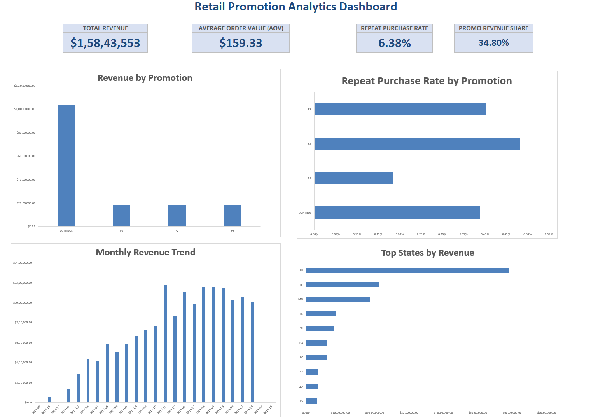
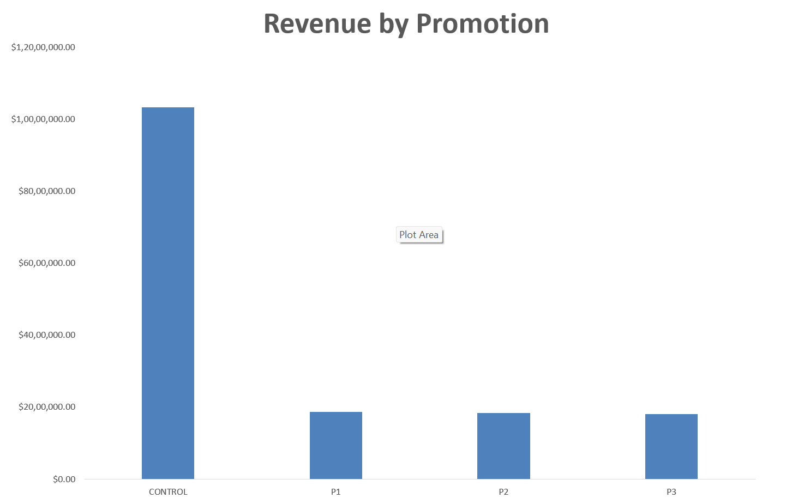
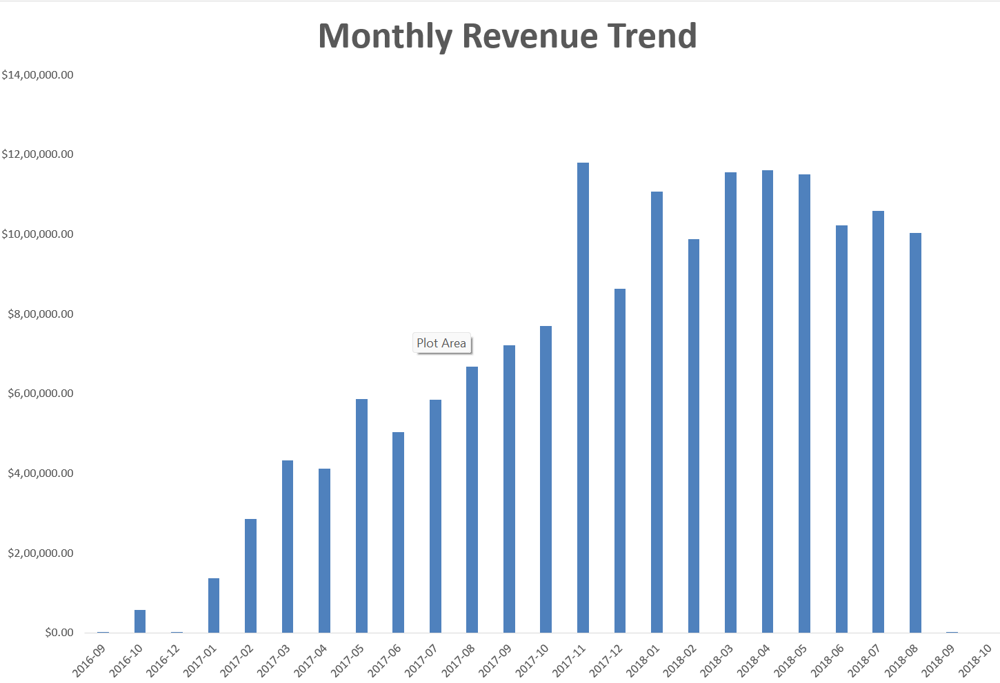
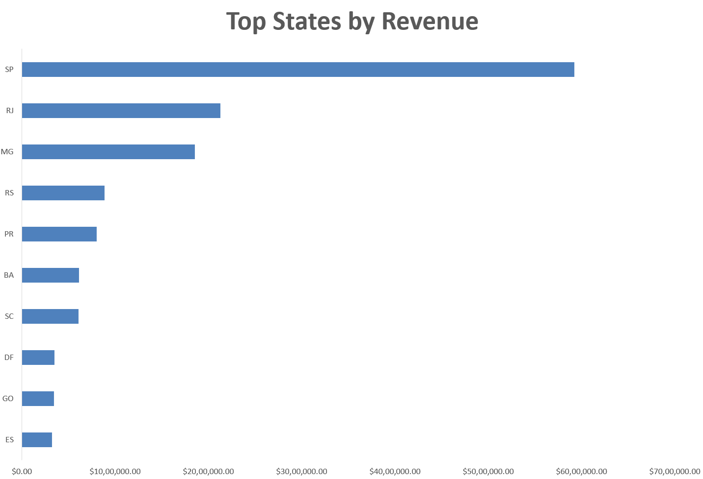
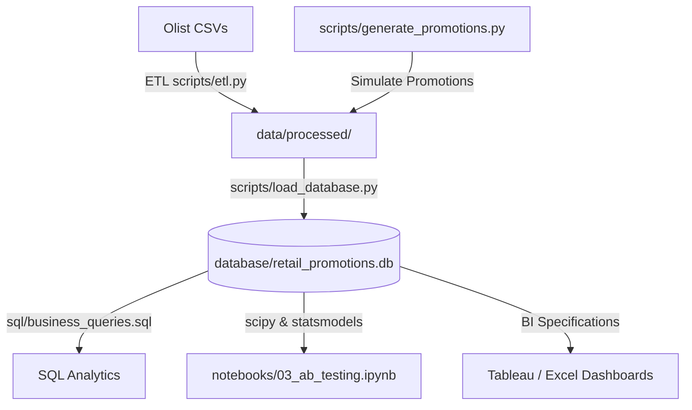

# Retail Promotion Analytics Platform

## Executive Summary
- **Business Challenge**: Evaluated the incremental business and statistical impact of promotional discount campaigns (5%, 10%, 20%) compared to a control group (no discount).
- **Scale of Analysis**: Analyzed a transaction footprint of 99,441 orders spanning 2016-2018.
- **Analytical Methods**: Engineered end-to-end Python ETL pipelines, implemented Star Schema relational models, executed A/B testing (Z-tests & independent t-tests), and defined BI dashboard structures.
- **Key Findings**: Promotional groups exhibited statistically detectable differences in repeat purchase behavior (Z-test p < 0.001), though the absolute conversion lift was modest. Average Order Value (AOV) differences were not statistically significant (t-test p = 0.344).
- **Tech Stack**: Python (Pandas, NumPy, SciPy, Statsmodels), SQLite (PostgreSQL compatible), SQL, Git/GitHub, Tableau/Excel Specifications.

## Dashboard Highlights

### Executive Dashboard


The central operational control center illustrating core KPIs (Revenue, AOV, Repeat Purchase Rates, and Promotional Shares) alongside performance metrics and breakdowns.

### Revenue by Promotion


A campaign-specific breakdown highlighting total revenue, order distributions, and comparative conversion returns across the control and treatment cohorts.

### Monthly Revenue Trend


A longitudinal view of sales trends across the dataset timeline comparing seasonal baseline control sales against targeted promotional campaigns.

### Top States by Revenue


A geographic responsiveness visualization mapping customer state distributions and transaction volume concentrations across Brazil.

## Business Problem
In retail and e-commerce, promotions are widely used to acquire customers, stimulate order size, and drive customer lifetime value. However, broad discount strategies risk margin cannibalization without yielding true customer retention. To ensure promotional spend is optimized, this platform establishes a formal experimentation framework to measure whether discounts drive incremental long-term repeat purchase rates and average order values, or if customer purchase behavior remains unchanged.

## Key Results

### Final Campaign Performance Summary
| Group | Revenue ($M) | AOV ($) | Repeat Purchase Rate |
|---|---:|---:|---:|
| Control | 10.33 | 159.80 | 6.39% |
| P1 (5%) | 1.86 | 159.97 | 6.18% |
| P2 (10%) | 1.84 | 159.14 | **6.48%** |
| P3 (20%) | 1.81 | 156.20 | 6.40% |

## Key Findings
- **P1 (5%)** generated the highest promotional revenue ($1.86M) while preserving baseline AOV ($159.97).
- **P2 (10%)** achieved the highest observed repeat purchase rate (6.48%), although the improvement relative to the control group was modest.
- **AOV differences were not statistically significant** (t-test p = 0.344), showing that discount incentives did not materially alter the average order size.
- **Modest Business Impact**: Although promotion groups exhibited statistically detectable differences in repeat purchase behavior (Z-test p < 0.001), the absolute effect sizes were small, suggesting limited practical business impact despite statistical significance.

## Business Recommendation
Based on the simulated experimentation framework, moderate discount strategies (e.g., 10%) may offer the strongest balance between customer retention and revenue preservation. However, future validation using real campaign data is required before operational deployment.

## Project Impact
- Processed and analyzed 99,441 e-commerce orders.
- Built an end-to-end analytics workflow spanning ETL, SQL, statistical testing, and dashboard reporting.
- Evaluated simulated promotion campaigns using A/B testing methodologies.
- Produced stakeholder-facing reporting assets in Excel and Tableau-compatible formats.
- Designed a reusable experimentation framework that can be extended to real promotional datasets.

## Technical Competencies Demonstrated
- **ETL Development**: Engineered automated Python pipelines utilizing Pandas and NumPy to execute data ingestion, validation, deduplication, and feature engineering.
- **Relational Data Modeling**: Designed a clean Star Schema database structure separating dimension tables (`dim_customers`, `dim_promotions`, `dim_date`) from fact tables (`fact_orders`, `fact_customer_metrics`).
- **SQL Analytics & KPI Development**: Authored complex SQL business queries to calculate regional and monthly campaign revenue trends, customer lifetime value, and AOV uplift.
- **Experimental Design & A/B Testing**: Implemented statistical tests using SciPy and Statsmodels, defining hypotheses, calculating confidence intervals, and reporting Cohen's d effect sizes.
- **Business Dashboard Specification**: Formulated detailed reporting specifications for Tableau and Excel dashboards targeting executive and operational stakeholders.
- **Analytics Engineering Practices**: Structured database loading scripts with dotenv configuration, verified query execution, and enforced strict reproducibility seeds.

### Portfolio Skills Demonstrated
- Developed an executive-style Excel dashboard using Pivot Tables, Pivot Charts, KPI scorecards, slicers, conditional formatting, and trend analysis to communicate campaign effectiveness, customer retention, and regional performance insights.

## Architecture Diagram


## Methodology
- **Simulation**: Generates promotional rules and deterministically assigns 35% of orders to promotion groups (P1, P2, P3) and 65% to control.
- **ETL Ingestion**: Extracts raw files, removes duplicates, executes missing value quality validations, and engineers feature columns (`order_value`, `promotion_flag`, `days_since_last_order`, `repeat_customer_flag`).
- **Database Loading**: Creates tables in a local SQLite database (supporting PostgreSQL migration via environment variables) and loads processed dimension and fact datasets.
- **Statistical Walkthroughs**: Evaluates cohort conversion differences via proportions Z-tests and continuous distribution metrics (AOV, CLV) using independent t-tests.
- **Reporting Specs**: Outlines Pivot tables, slicers, calculations, and visual charts for BI tools.

## Repository Structure
```
Retail-Promotion-Analytics/
├── data/
│   ├── raw/                  # Source CSV files (Immutable)
│   └── processed/            # Clean CSVs with engineered features
├── database/
│   └── retail_promotions.db  # Local SQLite database
├── excel/
│   ├── Promotion_Analytics_Dashboard.xlsx # Completed Excel workbook
│   └── excel_spec.md         # Spreadsheet design layout spec
├── images/
│   ├── dashboard.png
│   ├── revenuebypromo.png
│   ├── monthlytrend.png
│   └── topstates.png
├── notebooks/                # Jupyter Notebooks (Cleaning, EDA, Stats, Cohorts)
├── sql/                      # SQL assets (schema.sql, views.sql, business_queries.sql)
├── tableau/                  # BI Specifications
├── scripts/                  # Modular Python executable pipelines
├── reports/                  # Findings & Executive Summary Markdown templates
├── README.md
└── requirements.txt
```

## Setup Instructions

1. **Clone the Repository**:
   ```bash
   git clone https://github.com/Shanksreddy005/Retail-Promotion-Analytics-Platform.git
   cd Retail-Promotion-Analytics-Platform
   ```

2. **Install Dependencies**:
   ```bash
   pip install -r requirements.txt
   ```

3. **Add Data**:
   Download the Olist Brazilian E-Commerce dataset from Kaggle and place the CSV files in the project root directory before executing the pipeline.

4. **Run the Execution Pipeline**:
   Execute the following scripts sequentially:
   ```bash
   python scripts/generate_promotions.py
   python scripts/etl.py
   python scripts/load_database.py
   python scripts/create_excel_dashboard.py
   ```

## Methodology & Limitations
Promotions were synthetically assigned because the original Olist dataset does not contain campaign information. Consequently, this project demonstrates the construction of an experimentation and analytics framework rather than establishing causal effects from real-world interventions. Additionally, order-level assignment introduces customer-level cohort contamination for multi-order buyers, which is addressed in the recommendations.

## Future Improvements
- Integrate actual real-world promotion datasets.
- Implement uplift modeling to identify customer subgroups with high promotional responsiveness.
- Test promotion assignment stratification by state/region.
- Automate dashboard refresh processes using CLI triggers.
- Deploy the pipeline using orchestrators (e.g., Prefect or Airflow).
